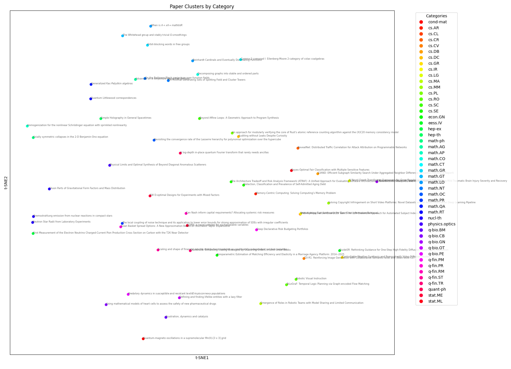

# Semantic Paper

Automatically categorizes academic papers from **arXiv** using semantic embeddings and maps them into a structured, searchable knowledge space.

##  Features
- Fetches and embeds arXiv papers
- Clusters papers by topic using machine learning
- Visualizes knowledge structure

---

### Example Cluster - will get updated with the last tried data ( trying 55 categories in this example =D ).

---
